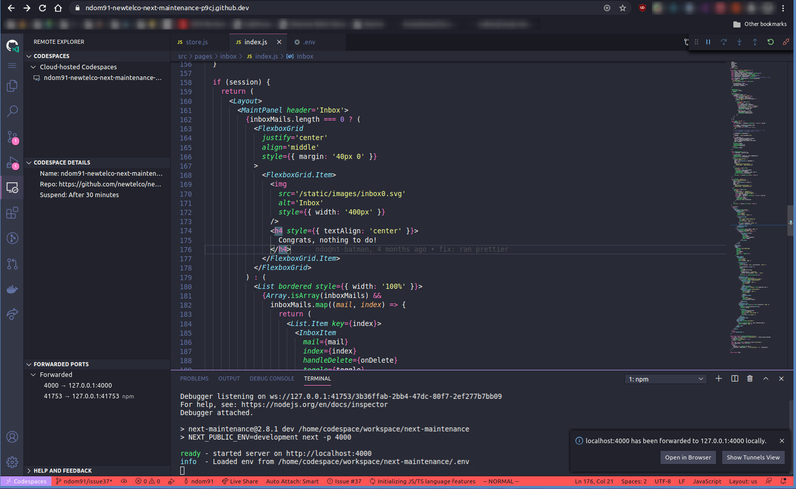
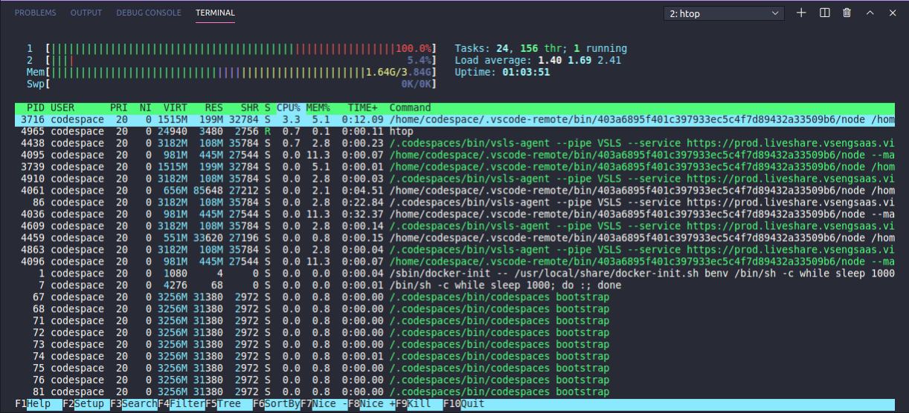
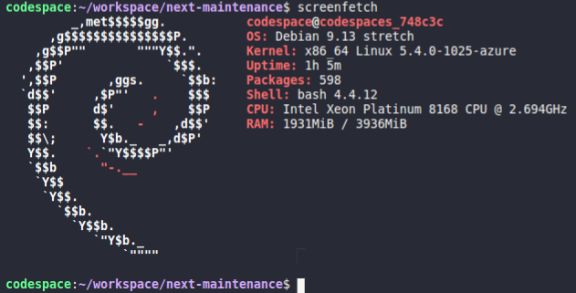

Github announced their new web based development environment called _Codespaces_ at their [Satellite 2020](https://github.blog/2020-05-06-new-from-satellite-2020-github-codespaces-github-discussions-securing-code-in-private-repositories-and-more/) Event. To be honest, this was the feature I was most excited about this year. And this evening, I finally got the email that I have access to the beta version of it!

First things first, I had some trouble finding out how to launch a codespace for a given repo. I navigated around the repo README page a bit, and eventually found the option under the green "Code" button, where you can open the collapsible menu that contains the clone URL. There is now also an option to open the repo in a new codespace / a list of any existing codespaces for that repository.

So I fired up my first codespace, and after approximately 45 seconds - 1 minute I was greeted with the all too familiar VS Code layout when you open a new project. They initially launched with a terminal open and a way too bright Github Theme. The first thing I did was install a Dracula Theme, the Vim Extension, and GitLens.


To my surprise, the extensions all installed without a hitch and "reloading" VS Code then only took as long as you'd expect a normal Github page reload to take. After which the theme was applied! I continued by doing what I'd do in any development environment, and installed the project's dependencies and fired up the dev server. This is where I noticed the first significant difference.



As soon as the development server was started, VS Code popped up a notification telling me the local development port had been forwarded. The action buttons on the notification were "Open in Browser" and "Show Tunnels View". Open in browser opened the dev environment in a new tab under a url such as: `[uuid].apps.codespaces.githubusercontent.com`. The next option, show tunnels view, was something new, however. This focused a new sidebar menu which gave an overview of the current container it was running in - which repo was opened, which ports were forwarded, and a line item which said "Suspend: After 30 Minutes". I assume that's the default time-out. After 30 minutes of inaction it will most likely tear down this container.

After making some minor changes to my code and feeling very at-home in this "new" VS Code environment, I decided to go digging a bit into what else I could see from inside this container.

I realized `apt` was installed in the container, so it had to be a debian-based distro, and installed a few applications. `vim` was already installed by default, by the way!



`htop` ran without a hitch and reported some interesting stuff. Looks like the container was given access to 2 cores and 4gb of RAM, and there was an odd process running:

```
/bin/sh -c while sleep 1000; do:; done
```

What could possibly be the point of this? As far as I can tell, this just loops every 1000 ms and does nothing, and then does nothing again 1000 ms later. What?

Anyway, what linux based post would be complete without a `screenfetch` screenshot!



Looks like its running Debian 9 Stretch and a relatively recent kernel (`5.4`). Based on the details here, including the CPU, this looks to be an Azure [Standard_F2s_v2](https://azure.microsoft.com/de-de/blog/fv2-vms-are-now-available-the-fastest-vms-on-azure/) instance.

In summary, without having spent a great deal of time with the new product - I can already say that I am a big fan and can definitely see the use-case for something like this. Kernel developers could work from a small chromebook in an airport and not have to worry about having a beefy machine to run builds on, etc. Web Devs have an easy to setup, common environment for their entire team to run and public development URLs which can be shared with colleagues or clients! VS Code feels just like it does on the desktop, because well - it is just like VS Code on the desktop, except for its in the browser. You get what I mean, its snappy, all the extensions I tested work, and it feels great.

Personally, I don't know if I'll be using it a ton because I don't have a direct use case for it at the moment, but I definitely am a big fan and wish the team at Github / Microsoft the best of luck with this!
