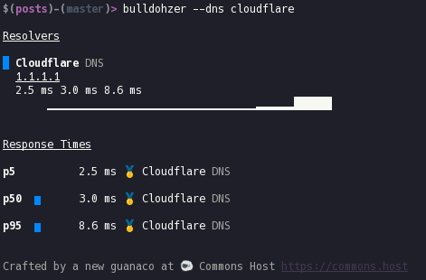
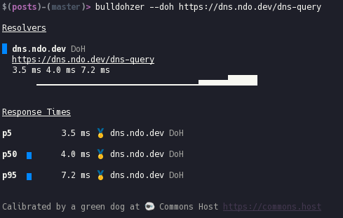

# dns.ndo.dev

With all the hype surrounding DNS-over-HTTPS (DoH), I wanted to try it out for myself and see what it was all about.

#### TL;DR

I've setup another public DoH Server with the following conditions:

- No Logging
- Not a forwarder, performs its own DNS resolution
- Ad Blocking Enabled
- No ECS
- QNAME Minimization
- HTTPS w/ TLS 1.3
- Unbound with DNSSEC

#### https://dns.ndo.dev/dns-query

Anyway, some background on what led me here.. I've had a Raspberry Pi running [`pi-hole`](https://pi-hole.net) in my basement for the past year or so, and that did a pretty good job of blocking ads and keeping my DNS queries private, but only inside the home..

I wanted to have this same privacy, performance, and control outside of the house as well.

# Server

I recently scraped together some parts and continued to build out my "homelab" setup. This most recent addition consisted of a 1U Supermicro Chassis housing an Intel X3480 @ 3 Ghz, 16gb of RAM, and 3TB of storage. Not a monster, but enough to do some plex streaming and hosting the odd web service.

I was lucky enough that my employer has some rack space I could use, so I was able to install it there with a public IP on the host (Proxmox).

## DoH + unbound

On to the software!

It seems the world is quickly moving towards DoH as the standard solution for private, secure DNS and I wanted in! Being the self-hosting nerd that I am, of course I wanted to run my own server.. A few google searches later I found this fantastic tutorial by Ben Tasker using [`github.com/m13253/dns-over-https`](https://github.com/m13253/dns-over-https) and [`Unbound`](https://nlnetlabs.nl/projects/unbound/about/) together.

I only have access to one public IP, and this is being used by the host, Proxmox, so I had to first setup the internal networking so that all the traffic to the VM's can get there and back out to the internet. Although it was a bit more complicated than running everything on one public facing server, it wasn't too much overhead.

In general, the architecture ended up looking like this:

```bash

                                                        +-------------------------+
                                                        |          DNS VM         |
                                                        +-------------------------+

                                                        +-------------------------+
+--------------+                                        |  Unbound (DNS Resolver) |
| PROXMOX HOST |                                        |      127.0.0.1:5083     |
+-------+------+                                        +------------+------------+
                                                                     |
                                                         +-----------+------------+
+-------+-------+                                        |        localhost       |
|     NGINX     |                                        |      8083 -> 5083      |
| listening 443 |                                        +-----------+------------+
+-------+-------+                                                    |
        |         +-----------------------------------+  +-----------+--------------+
+-------+------+  |       Internal Proxmox Network    |  |   dns-over-https server  |
|  dns.ndo.dev +--+ 127.0.0.1:443 -> 192.168.1.2:8083 +--+    listening on 8083     |
+--------------+  +-----------------------------------+  +--------------------------+
```

nginx is running on the Proxmox host listening on ports 80 and 443, so when one visits the HTTPS URL at the path `/dns-query` nginx on the proxmox host first terminates the SSL connection and then proxies the request downstream to the VM. The VM is doing the actual work, running the `dns-over-https` server software as well as unbound, a classic DNS server.

The request first goes to the DoH server which translates the request to an ordinary DNS request. This gets passed onto unbound which resolves it and passes it back up the chain and out the client who made the original request!

🙏 Aforementioned tutorial: [bentasker.co.uk](https://www.bentasker.co.uk/documentation/linux/407-building-and-running-your-own-dns-over-https-server)

#### I am reasonably commited to maintaining this public resolver unless the cost of maintenance becomes too high or people begin abusing it.

## Client

#### 🦊 Firefox

If you only want to test it inside a browser then Firefox has you covered with an `about:config` flag. Search for `trr` and change the following settings:

```
trr.bootstrapAddress:(empty)
trr.mode: 3
trr.uri: https://dns.ndo.dev/dns-query
```

More Info: [internetsociety.org](https://www.internetsociety.org/blog/2018/12/dns-privacy-support-in-mozilla-firefox/)

#### 💾 Chrome

On Chrome 78+ you can check out `chrome://flags/#dns-over-https`. As of this writing (27.09.2019) Google was only activating this option on a small subsection of users on all platforms other than Linux and iOS. Also clients using Enterprise managed Chrome instances will not have access to this _yet_.

More Info: [chromium.org](https://www.chromium.org/developers/dns-over-https)

#### 💻 OS

To use DNS over HTTPS on an OS level, you will have to install a client, such as the one included with the server software I used above which you can find it here: [github.com/m13253/dns-over-https](https://github.com/m13253/dns-over-https).

After installing the client service, open up `/etc/dns-over-https/doh-client.conf` in your favorite text editor and add another upstream resolver like such:

```
[[upstream.upstream_ietf]]
  url = "https://dns.ndo.dev/dns-query"
  weight = 50
```

Then change your OS network settings and point your DNS server to one of the IP / Port combinations on which this client is listening, found at the top of the config file. By default those are `127.0.0.1:53` and `127.0.0.1:5380`.

### Result

Of course I also couldn't pass up the opportunity to setup a little landing page for this service. So if you visit the root path ("/") at my dns domain, you will be greeted by a nice looking landing page, which you can find at [`dns.ndo.dev`](https://dns.ndo.dev)

You can test it out for yourself via curl, like such:

```bash
curl -s "https://dns.ndo.dev/dns-query?name=google.com&type=A" | python -m json.tool
```

### Benchmarks

These benchmarks were run Using `bulldohzer`. A general purpose DNS Benchmarking tool which supports standard DNS, DNS-over-HTTPS, and DNS-over-TLS. You can find it [here](https://github.com/commonshost/bulldohzer).

#### Using `cloudflare`



#### Using `dns.ndo.dev`



The server where this is currently running only has a 10mbit/s down and 2mbit/s up connection, so as I (hopefully) get a faster connection in the future this will improve as well. My server is also located in the same city as where I conducted this testing from. Although to be honest, I'm sure Cloudflare has ~~an~~ many edge nodes in Frankfurt too.
