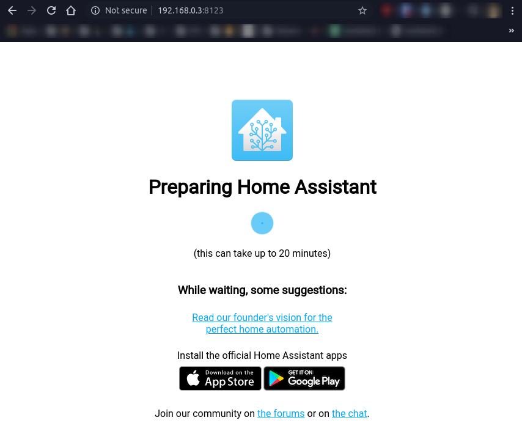

## Introduction

Quick wrap up of how to install HomeAssistant on a fresh RaspberryPi OS (32-bit) install. [Source](https://github.com/home-assistant/supervised-installer)

### Setup

First, setup your OS and update to the newest point by running the following:

```
sudo apt update
sudo apt upgrade -y
```

Once everything is up to date, we can begin installing prerequisites.

```
add-apt-repository universe
apt-get install -y apparmor-utils apt-transport-https avahi-daemon ca-certificates curl dbus jq network-manager socat software-properties-common
curl -sSL https://get.docker.com | sh
```

Then we have to disable ModemManager

```
systemctl disable ModemManager
apt-get purge modemmanager
```

And finally, we can run the HomeAssistant provided install script for the Docker based installation:

```
curl -sL "https://gist.githubusercontent.com/ndom91/0b285844bbe0ed2fff2eb1c8f0c80dd7/raw/48335557bdb71feea110579c86e3148d99f0000a/hassio-supervisor-installer.sh" | bash -s
```

> This is no longer an officially supported install method, but still works great. The above script is a self-hosted version of the official Hassio script they've taken offline.

Once this is run through you will find one lonely docker container, `hassio_supervisor`.

This container will begin pulling and setting up the remaining containers for hassio, including the audio server, dns, etc.

You can watch the progress by running, `sudo docker logs -f hassio_supervisor`.

Once all of the following containers are up and running, you can visit port `8123` on your pi's IP.

```
CONTAINER ID        IMAGE                                                  COMMAND                  CREATED              STATUS              PORTS               NAMES
8a45e312f9e6        homeassistant/raspberrypi4-homeassistant:landingpage   "/init"                  About a minute ago   Up About a minute                       homeassistant
b39de794b980        homeassistant/armv7-hassio-multicast:2                 "/init"                  3 minutes ago        Up 3 minutes                            hassio_multicast
29cdfbedb566        homeassistant/armv7-hassio-cli:25                      "/init /bin/bash -c …"   3 minutes ago        Up 3 minutes                            hassio_cli
53db8eca79f5        homeassistant/armv7-hassio-audio:14                    "/init"                  4 minutes ago        Up 4 minutes                            hassio_audio
78b26f41aae6        homeassistant/armv7-hassio-dns:9                       "/init coredns -conf…"   5 minutes ago        Up 5 minutes                            hassio_dns
19078153d374        homeassistant/armv7-hassio-supervisor                  "/init"                  7 minutes ago        Up 7 minutes                            hassio_supervisor
```

So in my example, `http://localhost:8123`.

This will bring up the "Preparing Home Assistant" screen. This process actually does take a while, so at this point maybe go have a smoke or make another coffee..



After the setup is done doing its thing, you will be presented with a User setup form.

Enter your chosen Name, Username, and Password.

Then you will be asked to name your instance, confirm your location, and a few other settings.

Finally you can setup some of the autodetected devices on your network and then you're in!

## Next Steps

At this point I would recommend installing the Hassio Google Drive Backup addon.

Available here: [sabeechen/hassio-google-drive-backup](https://github.com/sabeechen/hassio-google-drive-backup).

To restore a snapshot, login with your Google credentials and download your latest available snapshot.

Finally, `scp` that snapshot onto your pi to `/usr/share/hassio/backup`. You will then find it in the HomeAssistant UI under 'Supervisor' -> 'Snapshots' where you can wipe and restore to that snapshot.
