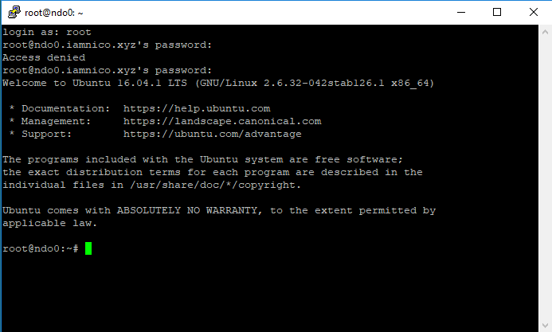

Here’s where one lands directly after the installation of a fresh Ubuntu image. In this case Ubuntu 16.04.

1. SSH into your machine with your favorite client [Win 32/64: [putty](https://www.putty.org/)]



So the first thing I like to do is create a new user for myself and add him to the `sudoers` group so he can (with password!) execute commands via `sudo`.

```bash
sudo add user ndo
usermod -aG sudo ndo
```

2. Now that we’ve got that out of the way, we’re going to want to step up our security a bit. To do that we’re going to immediately enable SSH access only via Public Key Authentication and disable password login entirely. This may not be entirely necessary if your machine is only available internally on your network. But if your machine is available on the public internet, I cannot recommend this enough!

If you do not have an ssh key yet, we will begin by generating a new pair.

Remember, you keep the private key well, private, and the public key gets stored on this server and any others you may wish to log into.

On your local machine, enter:

```bash
ssh-keygen
```

Next you’ll be prompted for a passphrase, I usually press enter here to leave this blank, but if you are extra paranoid or want to be extra secure – go ahead and enter a passphrase as well. Just beware you will have to enter this to login every time!

After that is complete it will tell us where the keys were saved so that we can use them.

If you’ve accepted the defaults your keys will look like this:
`/home/ndo/.ssh/id_rsa`
`/home/ndo/.ssh/id_rsa.pub`

On your local machine, you'll want to tell the `ssh` program to always try to use this private key to authenticate with when you ssh into servers that accept key authentication. To do this, you will have to tell your machine which key to use in your `/etc/ssh/ssh_config` file.

In my version of `openssh`, it was in `/etc/ssh/ssh_config` line `34`. Set the `IdentityFile` to the location of your new private key.

Next, on your new server, you will have to add the corresponding public key.

SSH back onto it, authenticating with the password still for now. Open `/etc/ssh/sshd_config` in your favorite text editor.

On line `37`, uncomment the line `PubkeyAuthentication yes`

On line `40`, uncomment the line which begins with `AuthorizedKeysFile` and take note of the file mentioned afterward.

Next, from your local machine, copy the contents of your public key (`id_rsa.pub`) into your clipboard, and on your server open up the file `/home/ndo/.ssh/authorized_keys` in your favorite text editor.

Finally, paste in your new public key and save and exit the `authorized_keys` file.

Restart `sshd` (SSH Daemon) on the server (`sudo systemctl restart sshd`) and now test the key authentication by trying to SSH onto your shiny new server without explicitly giving it a password. You should be looking right at a bash prompt without any further user input required!

If that worked, we will finally disable Password Authentication by editing the `sshd_config` file one more time.

On line `56` uncomment `PasswordAuthentication no` and save and quit the file.

While we’re in the SSH config, I also like to disable Root login via ssh: `PermitRootLogin no`

To apply our new changes, reload `sshd` one more time (`sudo systemctl restart sshd`)

> P.S. ssh-keygen on Linux generates SSH Keys in the OpenSSH format. If your going to be logging in from Putty on Windows, this will be a problem. Putty has its own format for keys and doesn’t play nice with OpenSSH.

3. Download my `dotfiles`

This one is easy:

`curl -Lks https://init.ndo.dev | /bin/bash`

This will download the init bash script I have available at the above URL and immediately execute it. If you are interested in the contents, it is available in my [`dotfiles repo`](https://github.com/ndom91/dotfiles) under `init.sh` and its sister script, `deploy.sh`.

4. Setup Vim

I have simplified this also to a single command as I do it every time I setup a new server / linux desktop. Its a command line argument to my `deploy.sh` script: `./deploy.sh vim`.

5. BONUS: Move SSH to a non-standard port

This has proven to be very important if you're on a server with a public IP address, as bots from all over the world scan the entire IPv4 address space all day long, looking for open port 22's and once they find you, will try to brute force your server for ever and ever.

So open up `/etc/ssh/sshd_config` again with your favorite text editor, and go to line `13`, uncomment the argument `Port` and change the number from 22 to something memorable for you, but sufficiently high and non-standard. Maybe 5000-something? ;)

Source: [digital ocean](https://www.digitalocean.com/community/tutorials/initial-server-setup-with-ubuntu-16-04)
