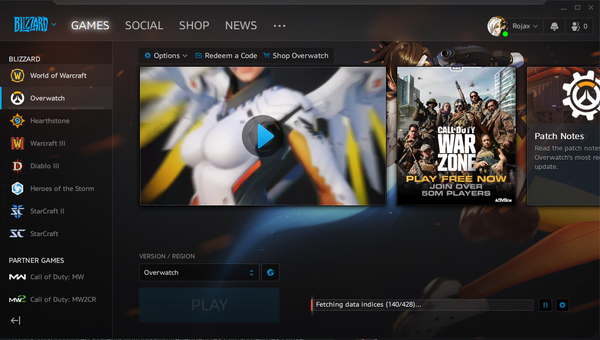

## Introduction

After not gaming for what feels like years, an urge to play Overwatch again struck me recently. Problem was, I dont have a windows PC to play it on anymore..

So I began diving into the current state of "gaming on linux" and boy oh boy was I surprised at the progress that community has made since I last gave all this a shot.

The modern gaming on linux journey begins with Lutris.

Lutris is a linux game launcher which takes care of installing Wine, many of the drivers and other launchers you may need.

In my case all I needed was the DXVK stuff, Battle.net, and a few odd ball prerequisites.

The install can be boiled down to the following however:

```bash
sudo pacman -Sy lutris wine-staging vulkan-icd-loader lib32-vulkan-icd-loader zenity lib32-gnutls lib32-libldap lib32-libgpg-error lib32-sqlite lib32-libpulse samba
```

The last `samba` dependency may seem like a bit much to install just for this, however a few of the ntlm libraries were required and I wasn't able to fulfill them with any other packages.

> I should mention I had the latest nvidia drivers already installed.

Anyway, after getting the dependencies installed you just launch lutris, search for "Overwatch" in the launcher and click **Install**. Lutris takes care of the rest.

What used to take hours of debugging and googling in 2020 now takes all of 20 minutes!


