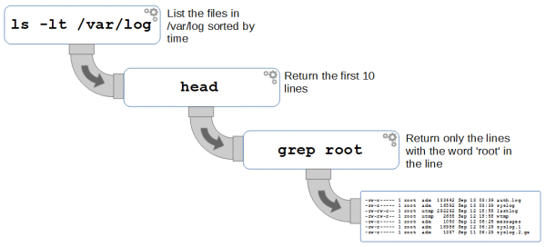

This table will hopefully help me keep the pipe madness in check.
I always forget, am I overwriting or appending? Am I including StdErr? Etc..

|           | visible in | terminal | visible | in file | existing file |
| --------- | ---------- | -------- | ------- | ------- | ------------- |
| Syntax    | StdOut     | StdErr   | StdOut  | StdErr  |
| ---       | ---        | ---      | ---     | ---     | ---           |
| >         | no         | yes      | yes     | no      | overwrite     |
| >>        | no         | yes      | yes     | no      | append        |
| 2>        | yes        | no       | no      | yes     | overwrite     |
| 2>>       | yes        | no       | no      | yes     | append        |
| &>        | no         | no       | yes     | yes     | overwrite     |
| &>>       | no         | no       | yes     | yes     | append        |
| tee       | yes        | yes      | yes     | no      | overwrite     |
| tee -a    | yes        | yes      | yes     | no      | append        |
| n.e. (\*) | yes        | yes      | no      | yes     | overwrite     |
| n.e. (\*) | yes        | yes      | no      | yes     | append        |
| & tee     | yes        | yes      | yes     | yes     | overwrite     |
| & tee -a  | yes        | yes      | yes     | yes     | append        |

